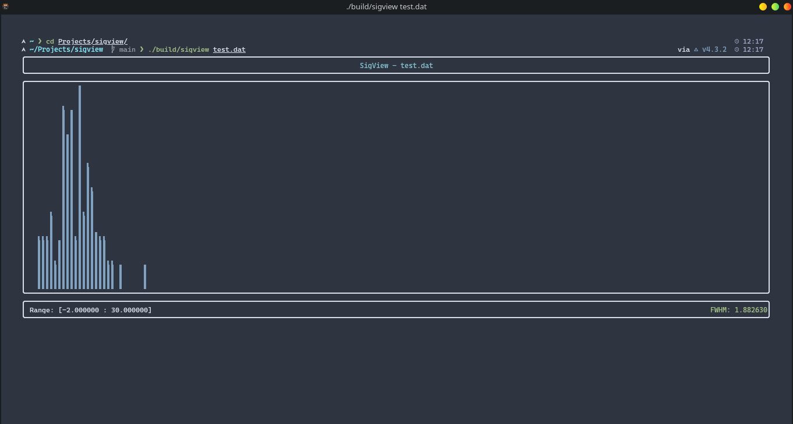

# sigview

A command-line waveform analyzer for detector output files, built for nuclear and particle physics experiments. Reads raw `.dat` files from charge-sensitive ADC readouts, computes charge spectra, and displays Full Width Half Maximum.

---

## Features

- Parses multi-channel `.dat` event files from detector readout systems
- Computes total charge per event from two channels (CH0 + CH1)
- Fills a histogram over a configurable charge range
- Reports mean, standard deviation, FWHM, min/max, and event counts
- Skips incomplete events (missing one channel) and reports them separately
- Interactive terminal interface via `SigView::RunInterface`

---

## Physics Background

The tool is designed for use with detectors such as Multi-Wire Proportional Counters (MWPCs) and similar gaseous ionization detectors. Each event in the input file corresponds to a particle interaction. The charge collected on each wire plane (CH0, CH1) is summed to give the total ionization charge `Q_total`. The resulting charge spectrum is used to extract:

- **Mean charge** and **standard deviation** across all complete events
- **FWHM** (Full Width at Half Maximum), computed as `2.355 * sigma`, a standard figure of merit for detector energy resolution

---

## Build

Requires CMake 3.15 or later and a C++20-capable compiler (GCC 10+, Clang 12+).

```bash
git clone https://github.com/harishyamkrishna/sigview.git
cd sigview
mkdir build && cd build
cmake ..
make
```

The build produces a `sigview` executable in the `build/` directory.

---

## Usage

```bash
./sigview <datafile.dat>
```

### Example

```bash
./sigview run042.dat
```

The program reads the file, processes all events, and launches the terminal interface showing the charge histogram and run statistics.

---

## Terminal Screenshot



## Input File Format

The parser expects `.dat` files with the following structure:

```
Event  <event_number>  <timestamp>
<channel_number>  <charge_value>  ...
<channel_number>  <charge_value>  ...
======================
Event  <event_number>  <timestamp>
...
```

Events with only one channel present are counted as skipped and excluded from statistics.

---

## Configuration

Histogram parameters are set in `include/Config.hpp`:

```cpp
static const double HIST_MIN   = -2.0;   // This is in pC
static const double HIST_MAX   = 30.0;   // This is in pC
static const int    HIST_BINS  = 200;    // number of bins

```

Adjust these to match the dynamic range of your detector and ADC.

---

## Project Structure

```
sigview/
├── include/
│   ├── Config.hpp          # Histogram range and bin configuration
│   ├── Histogram.hpp       # Histogram class declaration
│   ├── DatParser.hpp       # Event file parser declarations
│   └── App.hpp             # Terminal interface declaration
├── src/
│   ├── Histogram.cpp
│   ├── DatParser.cpp
│   └── App.cpp
│   └── main.cpp

└── CMakeLists.txt
```

---

## Output Statistics

At the end of a run, sigview reports:

| Quantity         | Description                          |
|------------------|--------------------------------------|
| Total events     | All event headers found in the file  |
| Complete events  | Events with both CH0 and CH1 present |
| Skipped events   | Events missing one channel           |
| Mean Q           | Mean total charge in pC              |
| Std deviation    | Standard deviation of Q in pC        |
| FWHM             | Energy resolution estimate in pC     |
| Min / Max Q      | Charge range across all events       |

---

## Dependencies

- C++20 standard library (no external dependencies for core logic)
- CMake for build system

---

## Author

Harishyam Krishna E K  
M.Sc. Physics, University of Calicut  
Specialization: Experimental Nuclear Physics and Detector Instrumentation  
Contact: ekharishyam@gmail.com  
LinkedIn: [linkedin.com/in/harishyamkrishna](https://linkedin.com/in/harishyamkrishna)
